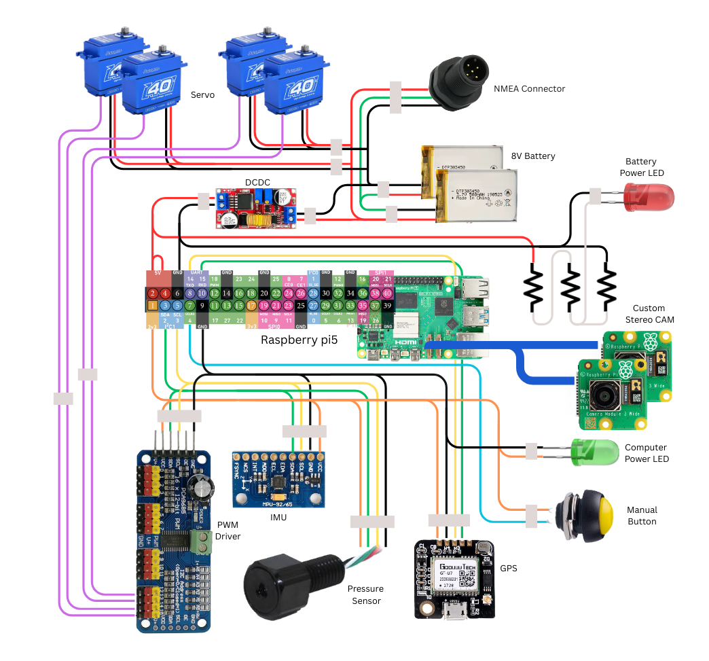

# Maui
 >**M**anta-inspired **A**utonomous-rover for **U**nderwater **I**nspections

 The following repo contains everything necessary to run the software on a rover with the caracteristics described following or to just check the results obtained from Tommaso Scudeletti's thesis

The main brain of the rover works inside a docker container running ROS2-jazzy.

In order to run and test the results obtained in your own computer just update *personal_ros2/compose.yaml* with the right directory of the ros2_ws folder and run `docker compose up -d` to create the container with the workspace files included and GUI available. 
> The software needed is:
> - Docker desktop
> - an X-server application like vxc...
> - VS-code with *docker* and *remote development* plugins
>
> For MAC more steps might be necessary for the x-server to work correctly 

Following is a description of the rover's hardware and connections followed by an analysis of the code's structure

## Rover Hardware:
- 4 PowerHD 40Kg waterproof sensors
- 2 silicon fins
- 2 plastinc rudders
- mpu9250 IMU
- Bluerobotics ms5837 underwater pressure sensor
- gtu7 GPS
- pca9685 PWM controller
- Raspberry-pi5
- 2 raspberry-pi CAM3

## Connections:

## Software:
The code is structured in two parts: 
- the drivers to enable the correct communication between the sensors and the computer
- the code running the logic of the control

The Logic of the control is inspired from the structure of the human brain from (ence the name **maui_brain**) and is devided in 5 different ros2 packages taking inspiration from the 5 main sections of a brain

 in order to structure the programs made based on the function they produce

Then all the right functions are started from launch files inside each package and different launch files are called in the more general package **maui**

> **Manta Connection**
>
> *hotspot_name:* maui-wifi
>
> *hotspot_password:* maui-wifi 
>

